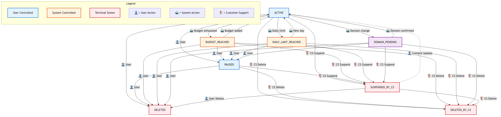

Ad statuses control whether your ads are eligible for serving and provide insight into why ads might not be active. Understanding these statuses is essential for managing your advertising campaigns effectively through our API.

Ad status values
^^^^^^^^^^^^^^^^

Understanding who controls ad status changes is essential for managing your advertising campaigns effectively. There are three types of actors that can affect ad status:

Seller/API Partner Actions
^^^^^^^^^^^^^^^^^^^^^^^^^^^

These statuses are controlled by you (the seller) or your API partners acting on your behalf:

.. list-table::
   :header-rows: 1
   :widths: 15 25 15 25

   * - Status
     - Meaning
     - Ad Serving
     - Available Actions
   * - ``ACTIVATED``
     - Ad is running and eligible for serving
     - ✅ **Serves**
     - Can pause or delete via API
   * - ``PAUSED``
     - Ad is temporarily stopped by you
     - ❌ Does not serve
     - Can activate or delete via API
   * - ``DELETED``
     - Ad is permanently removed by you
     - ❌ Does not serve
     - Terminal state - cannot be changed

Admin/CS Actions
^^^^^^^^^^^^^^^^

These statuses are set by Customer Support, Account Managers, or Platform Administrators for policy enforcement:

.. list-table::
   :header-rows: 1
   :widths: 20 25 15 20

   * - Status
     - Meaning
     - Ad Serving
     - Resolution
   * - ``SUSPENDED_BY_CS``
     - Ad violates platform policies and is suspended by support
     - ❌ Does not serve
     - Contact support AND update ad content
   * - ``DELETED_BY_CS``
     - Ad permanently removed for policy violations by support
     - ❌ Does not serve
     - Terminal state - cannot be restored

System Actions
^^^^^^^^^^^^^^

These statuses are set automatically by our system based on conditions and cannot be directly changed via API:

.. list-table::
   :header-rows: 1
   :widths: 20 25 15 20

   * - Status
     - Meaning
     - Ad Serving
     - Resolution
   * - ``BUDGET_REACHED``
     - Total ad budget is exhausted (automatic)
     - ❌ Does not serve
     - Increase total budget
   * - ``DAILY_LIMIT_REACHED``
     - Daily ad budget is exhausted (automatic)
     - ❌ Does not serve
     - Wait for new day or increase daily budget
   * - ``DOMAIN_PENDING``
     - New domain requires verification (automatic anti-phishing protection)
     - ❌ Does not serve
     - Verify domain via email (Marktplaats Console only)

Status precedence rules
^^^^^^^^^^^^^^^^^^^^^^^

.. important::
   When multiple conditions affect an ad, we show the most actionable status for you as the advertiser.

Non-budget statuses take priority
^^^^^^^^^^^^^^^^^^^^^^^^^^^^^^^^^

If your ad has multiple issues, we prioritize showing you the status you can directly act upon:

.. list-table::
   :header-rows: 1
   :widths: 20 20 20 20

   * - Your Ad State
     - Budget Condition
     - Status Shown
     - Why
   * - You paused it
     - Daily budget reached
     - ``PAUSED``
     - You can unpause it
   * - Domain pending (Marktplaats Console)
     - Budget reached
     - ``DOMAIN_PENDING``
     - You need to verify domain
   * - Currently active
     - Daily budget reached
     - ``DAILY_LIMIT_REACHED``
     - Budget is the blocking issue
   * - Currently active
     - Total budget reached
     - ``BUDGET_REACHED``
     - Budget is the blocking issue

.. note::
   Budget-related statuses (``BUDGET_REACHED``, ``DAILY_LIMIT_REACHED``) are only shown when your ad would otherwise be ``ACTIVE``.

Status change workflows
^^^^^^^^^^^^^^^^^^^^^^^

Seller/API Partner Workflows
^^^^^^^^^^^^^^^^^^^^^^^^^^^^^

* **Create ad** → ``ACTIVATED`` (if valid) or ``DOMAIN_PENDING`` (if new domain)
* **Pause campaign** → Set status to ``PAUSED`` via API
* **Resume campaign** → Set status to ``ACTIVATED`` via API
* **End campaign** → Set status to ``DELETED`` via API (terminal)

System Automated Workflows
^^^^^^^^^^^^^^^^^^^^^^^^^^^

**Budget exhaustion (automatic):**

* **Total budget exhausted** → ``BUDGET_REACHED``
* **Daily budget exhausted** → ``DAILY_LIMIT_REACHED`` (resets at midnight)

**Domain verification (automatic anti-phishing):**

1. URL changed to unverified domain → ``DOMAIN_PENDING``
2. Verify via email link → All pending ads for that domain become ``ACTIVATED``

.. note::
   Domain verification activates all pending ads for that domain, regardless of previous status.

.. note::
   Domain protection only available on Marktplaats Console interface.

Admin/CS Workflows
^^^^^^^^^^^^^^^^^^

**Policy enforcement (manual review):**

* **Policy violations detected** → Admin sets ``SUSPENDED_BY_CS`` or ``DELETED_BY_CS``
* **Recovery from suspension** → Requires content updates AND support approval
* **Permanent deletion** → ``DELETED_BY_CS`` is terminal, cannot be restored

Campaign status impact
^^^^^^^^^^^^^^^^^^^^^^

.. important::
   For an ad to be **visible to buyers**, both the ad status AND campaign status must allow serving:
   
   * **Campaign must be active** (not paused or out of budget)
   * **Ad must have a serving status** (``ACTIVE`` and not affected by budget/domain/CS restrictions)

Campaign status affects **ad visibility** (whether ads appear to buyers), not ad status itself. Individual ad statuses remain unchanged when campaign status changes.

**Key behaviors:**

* **Campaign paused or out of budget** → All ads in campaign become invisible to buyers
* **Individual ad statuses are never modified** by campaign status changes  
* **When campaign returns to active** → Ads return to visibility based on their individual statuses

Common workflows
^^^^^^^^^^^^^^^^

Budget management
^^^^^^^^^^^^^^^^^

* Daily budget reached → ``DAILY_LIMIT_REACHED`` (resets at midnight)
* Total budget reached → ``BUDGET_REACHED`` (increase budget to resume)

Domain change
^^^^^^^^^^^^^

* New domain → ``DOMAIN_PENDING`` (Marktplaats Console only)
* Verify via email → Becomes ``ACTIVE``

Handling suspensions
^^^^^^^^^^^^^^^^^^^^

* ``SUSPENDED_BY_CS`` → Update content and contact support → ``ACTIVE``

API integration best practices
^^^^^^^^^^^^^^^^^^^^^^^^^^^^^^^

Status polling
^^^^^^^^^^^^^^

* Check status regularly for critical ads
* Budget statuses change as spend accumulates
* ``DOMAIN_PENDING`` requires immediate action

Error handling
^^^^^^^^^^^^^^

* API rejects invalid status transitions
* ``DELETED`` and ``DELETED_BY_CS`` are terminal states
* ``SUSPENDED_BY_CS`` requires content updates, not status changes

Monitoring recommendations
^^^^^^^^^^^^^^^^^^^^^^^^^^

* Alert on budget status changes
* Monitor ``DOMAIN_PENDING`` email notifications
* Track ``SUSPENDED_BY_CS`` for policy issues

Troubleshooting
^^^^^^^^^^^^^^^

Ad not serving?
^^^^^^^^^^^^^^^

1. Check ad status - only ``ACTIVE`` ads serve
2. Check campaign status - must be active
3. Look for ``BUDGET_REACHED``, ``DAILY_LIMIT_REACHED``, ``DOMAIN_PENDING``, ``SUSPENDED_BY_CS``

Status won't change?
^^^^^^^^^^^^^^^^^^^^

**Check who controls the status:**

1. **Terminal states**: ``DELETED`` and ``DELETED_BY_CS`` cannot be changed
2. **System-controlled**: ``BUDGET_REACHED``, ``DAILY_LIMIT_REACHED``, ``DOMAIN_PENDING`` cannot be set via API - resolve the underlying condition
3. **Admin-controlled**: ``SUSPENDED_BY_CS`` requires support approval after content updates

Unexpected status changes?
^^^^^^^^^^^^^^^^^^^^^^^^^^

**Identify the actor that caused the change:**

1. **System actions**: Budget exhaustion and domain verification happen automatically
2. **Admin actions**: Policy reviews can result in ``SUSPENDED_BY_CS`` or ``DELETED_BY_CS``
3. **Check your API calls**: Verify your integration isn't making unintended status changes

Support
^^^^^^^

* Technical integration: API documentation
* Policy questions: Customer support
* Domain verification: Check email